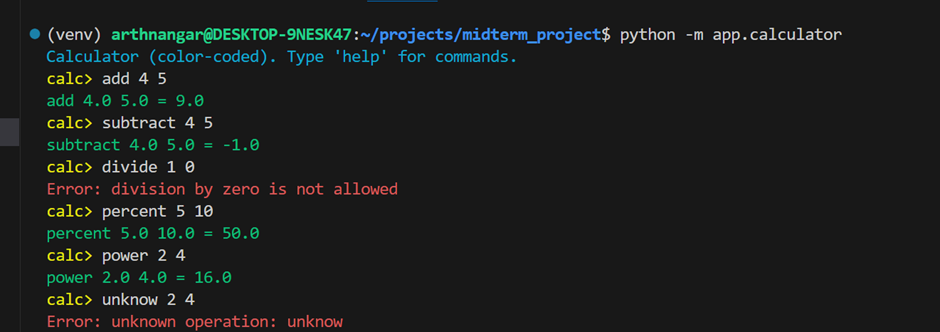

# Advanced Python Calculator -- Midterm Project
 **A modular, test-driven command-line calculator built using Factory, Observer, and Memento Design Patterns — with CI/CD automation and color-coded output.**

## Overview

This project is an **Advanced Calculator Application** developed as a midterm project.  
It supports multiple arithmetic operations, **undo/redo functionality**, **logging**, **auto-saving**, and a **command-line REPL interface**.

The project demonstrates solid **software design patterns** (Factory, Memento, Observer) and uses **pytest + GitHub Actions** for testing and CI/CD automation.

## Features

###  Core Functionalities
- **Basic arithmetic:** `add`, `subtract`, `multiply`, `divide`
- **Advanced operations:**
  - `power` → raise a number to another  
  - `root` → nth root calculation  
  - `modulus` → remainder of division  
  - `int_divide` → integer division  
  - `percent` → percentage `(a / b) * 100`  
  - `abs_diff` → absolute difference `|a - b|`
- **Undo / Redo** → revert or reapply last calculation
- **History Management** → view or clear previous results
- **Error Handling** → clear messages for invalid input or zero division
- **Observer Pattern:**
  - `LoggingObserver` → writes each operation to a log file
  - `AutoSaveObserver` → auto-saves calculation history to CSV
- **Color-Coded Output** using Colorama
  - Green = success  
  - Yellow = warnings or undo/redo actions  
  - Red = errors

## Design Patterns Used

 Pattern  Purpose

 **Factory** Creates calculation objects dynamically based on the operation type 

**Memento** Enables undo/redo functionality by saving calculator state 

**Observer** Notifies observers for logging and autosave after each calculation

## Setup & Installation Guide
Follow these steps to clone and run the project on your local machine:
```bash

# Clone the Repository
git clone https://github.com/ArthNangar/midterm_project.git
cd midterm_project

# Create virtual environment
python -m venv venv

# Activate it
# On macOS/Linux:
source venv/bin/activate

# Install Dependencies
pip install -r requirements.txt

# Run Test cases 
pytest

# Run the main app
python -m app.calculator

```


## Folder Structure

```bash
midterm_project/
├── app/
│ ├── init.py
│ ├── calculator.py
│ ├── calculation.py
│ ├── config.py
│ ├── calculator_memento.py
│ ├── exceptions.py
│ ├── history.py
│ ├── input_validators.py
│ ├── operations.py
│ ├── logger.py
│ └── decorators.py
│
├── tests/
│ ├── test_calculator.py
│ ├── test_calculation.py
│ ├── test_history.py
│ ├── test_operations.py
│ └── init.py
│
├── .github/workflows/automated_tests.yml
├── .env
├── requirements.txt
└── README.md
```

## Command-Line Interface (REPL)
```
▶️ Start the calculator:

python -m app.calculator
Example session:
Copy code
Calculator. Type 'help' for commands.
calc> add 2 3
add 2.0 3.0 = 5.0
calc> power 2 3
power 2.0 3.0 = 8.0
calc> undo
Last operation undone.
calc> redo
Last operation redone.
calc> history
add 2.0 3.0 = 5.0
power 2.0 3.0 = 8.0
calc> clear
History cleared.
calc> help
Commands:
add a b - addition
subtract a b – subtraction
multiply a b – multiplication
divide a b – division
power a b – a^b
root a b – b-th root of a
modulus a b – a % b
int_divide a b – integer division
percent a b – (a/b)*100
abs_diff a b – |a-b|
history: show history
clear: clear history
undo: undo last operation
redo: redo last undone operation
exit: quit the program
```

## Unit Testing & Coverage
All tests are written using pytest.

Run tests:
```

pytest

Run with coverage:
pytest --cov=app --cov-report=term-missing

```

## Optional Advanced Features Implemented
✅ Color-Coded Output: Below is the image showing the color coded.



### Technologies Used
```
Python 3.11+

pytest / pytest-cov

pandas

python-dotenv

colorama

GitHub Actions
```


## 👨‍💻 Author
Arth Ranchhodbhai Nangar

Date: 10/24/2025

an848@njit.edu